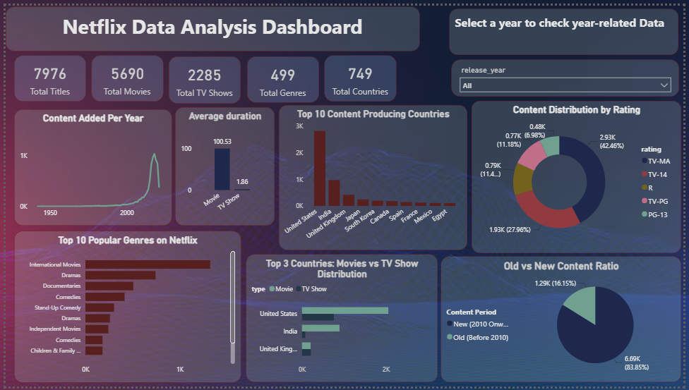

# 🎬 Netflix Content Analysis — End-to-End Data Analytics Project

## 📌 Project Overview
An end-to-end data analytics project analyzing Netflix's global content library to uncover trends in content type, ratings, genres, countries, and release patterns. This project follows a complete data pipeline — from raw data cleaning to business analysis and interactive visualization — replicating a real-world data analyst workflow.

## 🔄 Project Workflow
Raw Dataset → Python (Data Cleaning & EDA) → PostgreSQL (Business Analysis) → Power BI (Interactive Dashboard)

## 🛠️ Tools & Technologies
| Tool | Purpose |
|------|---------|
| Python (Pandas, NumPy, Matplotlib, Seaborn) | Data Cleaning & Exploratory Data Analysis |
| Jupyter Notebook | Development Environment |
| PostgreSQL (pgAdmin 4) | Business Question Analysis via SQL |
| Power BI Desktop | Interactive Dashboard & Visualization |

## 🚀 Skills Demonstrated
Data Wrangling, SQL Subqueries & Window Functions, EDA, Business Intelligence, Data Visualization

## 📂 Repository Structure
End-to-End-Netflix-Analytics/
├── Data-Wrangling-and-Insights.ipynb          # Python cleaning & EDA
├── Netflix-SQL-Data-Analysis.sql              # SQL business analysis
├── Netflix-Content-Intelligence-Dashboard.pbix # Power BI dashboard file
├── Netflix-Dashboard-Preview.png              # Dashboard screenshot
└── README.md

---

## 🐍 Phase 1: Data Cleaning & EDA (Python)
Performed initial data wrangling to prepare the raw Netflix dataset for analysis:
- Handled missing values in `director`, `cast`, and `country` columns
- Removed duplicate records
- Standardized inconsistent date formats
- Conducted exploratory analysis to understand overall content structure and distribution

📎 **File:** [Data-Wrangling-and-Insights.ipynb](./Data-Wrangling-and-Insights.ipynb)

---

## 🗄️ Phase 2: SQL Business Analysis (PostgreSQL)
Solved 15+ real-world business questions using SQL, covering:
- Content type & rating distribution
- Top 10 content-producing countries
- Longest duration movies and TV shows
- Year-wise content release trends (Movies vs TV Shows)
- Director-wise content contribution
- Genre-based content distribution
- TV shows exceeding 5 seasons
- Actor-specific content filtering
- Average content release trends by country (using subqueries)
- Ranking analysis using window functions

📎 **File:** [queries.sql](./queries.sql)
   **File:** [schema.sql](./schema.sql)

---

## 📊 Phase 3: Power BI Dashboard
Built an interactive dashboard to visualize key metrics:
- KPI Cards: Total Titles, Movies, TV Shows, Genres, Countries
- Content Added Per Year (Trend Line)
- Average Duration by Content Type
- Top 10 Content-Producing Countries
- Content Distribution by Rating
- Top 10 Popular Genres
- Movies vs TV Show Distribution by Country
- Old vs New Content Ratio

📎 **File:** [Netflix-Content-Intelligence-Dashboard.pbix](./Netflix-Content-Intelligence-Dashboard.pbix)

---

## 💡 Key Insights
- The **United States** leads global content production, followed by **India**.
- **TV-MA** is the most common content rating, indicating a strong focus on mature audiences.
- **Movies significantly outnumber TV Shows** across the entire platform.
- Content additions **increased sharply after 2015**, aligning with Netflix's global expansion phase.
- **International Movies** and **Documentaries** are among the most frequently listed genres.
- The average movie duration is approximately **100 minutes**, while the average TV show spans nearly **2 seasons**.

---

## 🚀 How to Use This Project
1. Clone or download this repository
2. Open `Data-Wrangling-and-Insights.ipynb` in Jupyter Notebook to review the data cleaning process
3. Run the queries in `Netflix-SQL-Data-Analysis.sql` using PostgreSQL (pgAdmin) to explore the business analysis
4. Open `Netflix-Content-Intelligence-Dashboard.pbix` in Power BI Desktop to interact with the dashboard

---

## 👤 Author
**Urwa Kausar**
📧 [urwakausar55@gmail.com]
🔗 [https://www.linkedin.com/in/urwa-kausar-7846073a7?utm_source=share_via&utm_content=profile&utm_medium=member_android]
🔗 [https://github.com/Urwa-Kausar55/My-Projects/blob/main/End-to-End-Netflix-Analytics%2FREADME.md]
