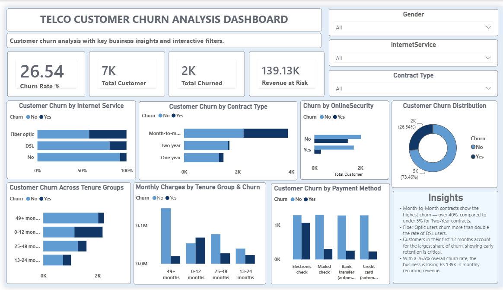

# Telco Customer Churn Analysis

An end-to-end data analysis project exploring customer churn patterns, revenue impact, and risk segmentation using a telecom customer dataset. The project covers the full pipeline: data cleaning, SQL-based analysis, and an interactive Power BI dashboard.

## Project Overview

Customer churn is one of the most critical problems telecom companies face. This project analyzes customer data to answer key business questions:

- What percentage of customers are churning, and how much revenue is at risk?
- Which contract types, payment methods, and services are most associated with churn?
- Which customer segments are at the highest risk of leaving?
- What can the business do to improve retention?

## Tools Used

- Python (Pandas) — Data cleaning and preparation
- PostgreSQL — Data storage and SQL-based analysis
- Power BI — Interactive dashboard and DAX-based metrics

## Workflow

### 1. Data Cleaning (Python)
Raw customer data was cleaned and prepared using Python before being loaded into PostgreSQL, including handling inconsistent values and verifying data types. See [Churn-Analysis.ipynb](https://github.com/Urwa-Kausar55/My-Projects/blob/main/End-to-End-Telco-Customer-Churn-Analysis/Churn-Analysis.ipynb).

### 2. SQL Analysis (PostgreSQL)
24 SQL queries were written to explore the cleaned dataset, covering:
- Data validation (missing values, duplicates, edge cases such as zero-tenure customers)
- Overall churn rate and revenue impact
- Churn breakdown by contract type, payment method, internet service, and tenure
- Customer risk segmentation (e.g., customers without OnlineSecurity or TechSupport)
- Window functions, CTEs, and ranking to identify high-value churned customers

Key data quality note: 11 customers were identified with tenure = 0 (newly joined customers with no billing history yet). These were verified as valid records, not missing data.

See [TELCO_CHURN_SQL_PROJECT.sql](https://github.com/Urwa-Kausar55/My-Projects/blob/main/End-to-End-Telco-Customer-Churn-Analysis/TELCO_CHURN_SQL_PROJECT.sql) for the full query set.

### 3. Power BI Dashboard
An interactive dashboard was built using the cleaned dataset, including:
- 9 DAX measures (Total Customers, Churn Rate %, Revenue at Risk, Average Tenure, High-Risk Churners, and more)
- 1 calculated column (Tenure Group segmentation)
- 9 visuals covering churn by contract type, internet service, payment method, tenure group, and online security
- Interactive slicers (Gender, Internet Service, Contract Type)
- A business insights panel summarizing key findings

See [telco_churn_dashboard.pbix](https://github.com/Urwa-Kausar55/My-Projects/blob/main/End-to-End-Telco-Customer-Churn-Analysis/telco_churn_dashboard.pbix) for the interactive file, or [Telco_Churn_Analysis_Preview.png](https://github.com/Urwa-Kausar55/My-Projects/blob/main/End-to-End-Telco-Customer-Churn-Analysis/Telco_Churn_Analysis_Preview.png) for a quick preview.

## Key Findings

- Churn Rate: 26.54% of customers have churned, putting approximately Rs 139.13K in monthly recurring revenue at risk.
- Contract Type: Month-to-Month contracts show the highest churn (over 40%), compared to under 5% for Two-Year contracts.
- Internet Service: Fiber Optic users churn at more than double the rate of DSL users.
- Tenure: Customers in their first 12 months account for the largest share of churn, highlighting the importance of early-stage retention.
- Risk Segment: Customers without OnlineSecurity and TechSupport represent a significantly higher-risk group.

## Business Recommendation

Retention efforts should prioritize Month-to-Month customers within their first 12 months, particularly those without OnlineSecurity or TechSupport add-ons, as this segment shows the highest combined churn risk.

## Files in This Repository

- [Churn-Analysis.ipynb](https://github.com/Urwa-Kausar55/My-Projects/blob/main/End-to-End-Telco-Customer-Churn-Analysis/Churn-Analysis.ipynb) — Python data cleaning notebook
- [Telco-Customer-Churn.csv](https://github.com/Urwa-Kausar55/My-Projects/blob/main/End-to-End-Telco-Customer-Churn-Analysis/Telco-Customer-Churn.csv) — Cleaned dataset
- [TELCO_CHURN_SQL_PROJECT.sql](https://github.com/Urwa-Kausar55/My-Projects/blob/main/End-to-End-Telco-Customer-Churn-Analysis/TELCO_CHURN_SQL_PROJECT.sql) — Full SQL analysis (data validation through business queries)
- [telco_churn_dashboard.pbix](https://github.com/Urwa-Kausar55/My-Projects/blob/main/End-to-End-Telco-Customer-Churn-Analysis/telco_churn_dashboard.pbix) — Power BI dashboard file
- [Telco_Churn_Analysis_Preview.png](https://github.com/Urwa-Kausar55/My-Projects/blob/main/End-to-End-Telco-Customer-Churn-Analysis/Telco_Churn_Analysis_Preview.png) — Dashboard preview

## Dashboard Preview

## Connect With Me

GitHub: https://github.com/Urwa-Kausar55

LinkedIn: https://www.linkedin.com/in/urwa-kausar-7846073a7

---

Author: Urwa Kausar